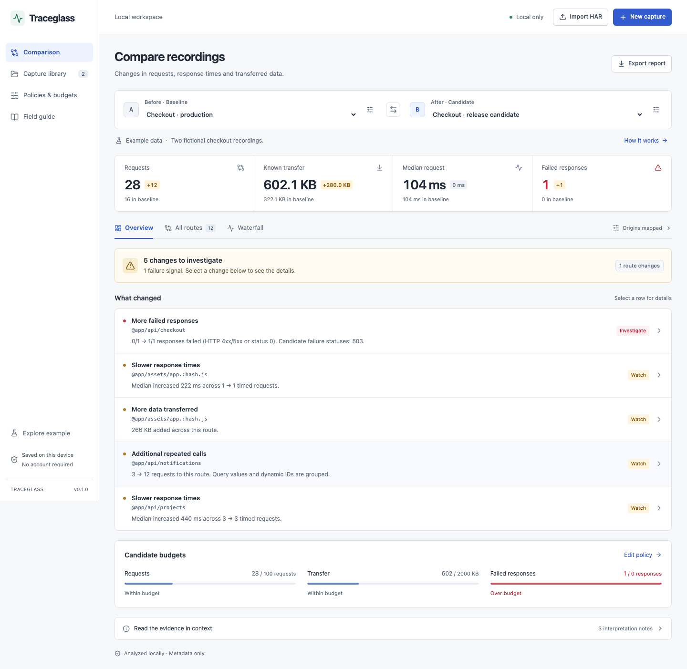

# Traceglass

[](https://github.com/dharmendrathinks/traceglass/actions/workflows/ci.yml)
[](LICENSE)

**Compare what your website requests before and after a change.**

Traceglass is a Chrome DevTools extension for comparing two network recordings.
Perform the same actions on two builds, then inspect failed responses, slower routes,
extra calls and larger downloads. Everything is processed locally, with no account,
telemetry, cloud service or AI API.



## Install

1. Download `traceglass-0.1.0.zip` from [GitHub Releases](https://github.com/dharmendrathinks/traceglass/releases/latest).
2. Extract the ZIP into a folder you will keep on your computer.
3. Open `chrome://extensions`, enable **Developer mode**, then choose **Load unpacked** and select the extracted folder containing `manifest.json`.
4. Open a website, open **DevTools**, and select **Traceglass**. It may be under the **»** menu. Close and reopen DevTools if the tab does not appear.
5. Choose **Explore the example** to try a comparison with fictional data.

Traceglass is not yet published on the Chrome Web Store. GitHub releases are installed manually. For updates, replace the extracted files and click **Reload** on the extension card. Export important captures before moving or replacing an installation; unpacked extensions can receive a different identity when their directory changes.

Chrome 120+ is declared as the minimum based on the APIs used. Tests run with the Chromium version pinned by Playwright in the lockfile. Older Chrome releases and other Chromium browsers have not been separately certified.

## How it works

**You perform the test. Traceglass records and compares the requests.** It does not infer your test case or replay clicks.

1. **Before:** Click **New capture**, name the recording, and start. Perform an action such as adding a product and checking out. Wait for requests to finish, then stop and save.
2. **After:** Start another capture on the updated website. Repeat the same actions with comparable data, cache and network settings. Stop and save.
3. **Compare:** Select those recordings as **Before · Baseline** and **After · Candidate**. Select a finding to inspect the evidence.

The toolbar icon opens a full-page workspace for importing HAR files and working with saved captures. Live recording takes place in DevTools for the inspected tab. Refresh another open workspace to see recordings saved elsewhere.

## Features

- Explicit start/stop recording across page navigations.
- Local HAR and portable JSON imports, validated in a dedicated worker.
- Route comparisons for failure rates, median response times, request counts and transferred bytes.
- Primary-origin mapping for staging-to-production comparisons, plus normalization of common dynamic IDs and asset hashes.
- Searchable routes, request waterfalls on a shared time axis, and configurable thresholds and budgets.
- A local capture library with editing, deletion and JSON export.
- Standalone HTML and Markdown reports that work offline.
- A built-in synthetic example and a local test website with deliberate regressions.

## Privacy and measurement limits

Headers, cookies, request/response bodies, query values, URL credentials and fragments are excluded from saved captures. **Hostnames, normalized paths, labels and notes can still contain sensitive information.** Traceglass minimizes retained data; it does not guarantee anonymization. See the [privacy notice](docs/PRIVACY.md).

Only HTTP(S) requests that finish during recording are included. No automated replay, response-body inspection, screenshots, console capture, WebSocket frames or Web Vitals are collected.

Routes match by method, effective origin and normalized path. Distinct GraphQL operations and query-based actions may be combined. Unknown transfer sizes remain unknown. P95 is shown only with at least 20 timed requests per route. Comparing two recordings does not establish statistical significance or release readiness.

Limits: 20 MB per imported file, 5,000 entries per capture, 40 saved captures, 40 routes per table page, 50 initial findings and 100 requests per waterfall lane. All retained requests contribute to analysis even when display limits apply. Closing DevTools or the capture dialog discards an unsaved recording.

## Develop

Use Node 22+ and npm. From the repository root:

```sh
npm ci
npx playwright install chromium
npm run check
npm run package
```

On Linux, use `npx playwright install --with-deps chromium` to install browser system dependencies. The package is written to `artifacts/`, with a SHA-256 file. For local development, load `dist/` as an unpacked extension.

- `npm run dev` — start the workspace UI; recording requires the installed extension.
- `npm run check` — type checking, lint, formatting, 48 unit tests, production build and 8 browser tests.
- `npm run fixture` — run the synthetic checkout website at `http://127.0.0.1:4174`.
- `npm run package` — build the extension ZIP with privacy and license notices.

To test recording, open the fixture, record **Baseline → Run checkout journey**, then repeat with **Candidate**. Wait for **Journey complete** before stopping each recording. The candidate deliberately adds a 503 checkout response, slower project requests, repeated notifications and a larger bundle. The fixture uses fictional data and only loopback traffic.

Tests require no accounts or credentials. They use ports 43173/43174 and fail if those ports are occupied. Browser tests include actual DevTools recording, production-CSP imports, accessibility scans and narrow layouts.

## Architecture

```text
DevTools events ──┐
                 ├── allowlisted metadata ── IndexedDB ── comparison ── UI / reports
HAR file → worker┘
```

The comparison engine is independent of React and Chrome. Strict schemas guard imports and persistence, IndexedDB writes are atomic, and bounded worker processing keeps file parsing off the UI thread. The extension requests no host permissions and its CSP blocks outgoing connections from extension pages.

See [engineering decisions](docs/ENGINEERING.md) for algorithms, lifecycle, trust boundaries and testing tradeoffs.

## Contribute and get help

[Report a bug or request a feature](https://github.com/dharmendrathinks/traceglass/issues/new/choose).
Use synthetic examples; do not attach private recordings. Read [CONTRIBUTING.md](CONTRIBUTING.md) and the [Code of Conduct](CODE_OF_CONDUCT.md) before contributing. Report vulnerabilities privately as described in [SECURITY.md](SECURITY.md).

## License

[MIT](LICENSE), copyright 2026 Dharmendra. Bundled dependencies retain their respective licenses; release ZIPs include `THIRD_PARTY_NOTICES.txt`. The npm package is marked private to prevent accidental npm publication; that does not restrict the MIT license.

[Changelog](CHANGELOG.md) · [Release process](docs/RELEASE.md) · [Privacy](docs/PRIVACY.md)
